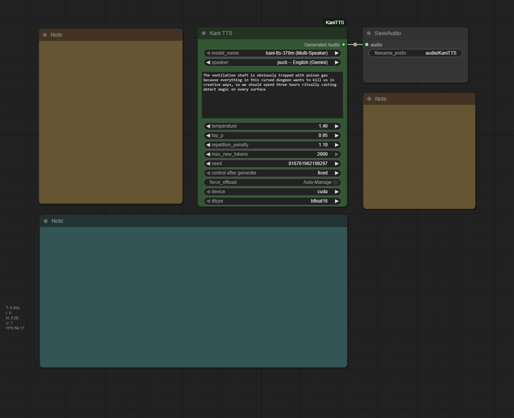

<a id="readme-top"></a>

<div align="center">
  <h1 align="center">ComfyUI-KaniTTS</h1>

  <a href="https://github.com/wildminder/ComfyUI-KaniTTS">    
    
  </a>
  
  <p align="center">
    A custom node for ComfyUI that integrates <strong>KaniTTS</strong>, a family of high-speed, high-fidelity Text-to-Speech models optimized for real-time applications.
    <br />
    <br />
    <a href="https://github.com/wildminder/ComfyUI-KaniTTS/issues/new?labels=bug&template=bug-report---.md">Report Bug</a>
    ·
    <a href="https://github.com/wildminder/ComfyUI-KaniTTS/issues/new?labels=enhancement&template=feature-request---.md">Request Feature</a>
  </p>
</div>

<!-- PROJECT SHIELDS -->
<div align="center">

[![Stargazers][stars-shield]][stars-url]
[![Issues][issues-shield]][issues-url]
[![Forks][forks-shield]][forks-url]

</div>

<br>

## About The Project

KaniTTS is a high-speed, high-fidelity Text-to-Speech (TTS) model family designed for real-time conversational AI applications. It uses a novel two-stage pipeline, combining a powerful language model with an efficient audio codec to deliver exceptional speed and audio quality.

<div align="center">
      
  </div>
  
This custom node handles everything from model downloading and memory management to audio processing, allowing you to generate high-quality speech directly from a text script using a variety of voices and models.

**✨ Key Features:**
*   **Multi-Speaker Synthesis:** Use the `kani-tts-370m` model to choose from a diverse list of predefined voices in multiple languages.
*   **Variety of Models:** Access five different KaniTTS models, including base versions for creative, randomized voices and fine-tuned versions for specific vocal characteristics.
*   **Automatic Model Management:** All required KaniTTS and NeMo codec models are downloaded automatically and managed efficiently by ComfyUI to save VRAM.
*   **Fine-Grained Control:** Adjust parameters like temperature, top-p, and repetition penalty to tune the performance and style of the generated speech.
*   **High-Efficiency Synthesis:** KaniTTS is optimized for low-latency inference on edge devices or affordable servers, generating 15 seconds of audio in under a second on modern GPUs.

<p align="right">(<a href="#readme-top">back to top</a>)</p>

<p align="center">══════════════════════════════════</p>

Beyond the code, I believe in the power of community and continuous learning. I invite you to join the 'TokenDiff AI News' and 'TokenDiff Community Hub'

<table border="0" align="center" cellspacing="10" cellpadding="0">
  <tr>
    <td align="center" valign="top">
      <h4>TokenDiff AI News</h4>
      <a href="https://t.me/TokenDiff">
        
      </a>
      <p><sub>🗞️ AI for every home, creativity for every mind!</sub></p>
    </td>
    <td align="center" valign="top">
      <h4>TokenDiff Community Hub</h4>
      <a href="https://t.me/TokenDiff_hub">
        
      </a>
      <p><sub>💬 questions, help, and thoughtful discussion.</sub> </p>
    </td>
  </tr>
</table>

<p align="center">══════════════════════════════════</p>

## 🚀 Getting Started

The easiest way to install is via **ComfyUI Manager**. Search for `ComfyUI-KaniTTS` and click "Install".

Alternatively, to install manually:

1.  **Clone the Repository:**

    Navigate to your `ComfyUI/custom_nodes/` directory and clone this repository:
    ```sh
    git clone https://github.com/wildminder/ComfyUI-KaniTTS.git
    ```

> [!WARNING]
> KaniTTS requires specific and potentially conflicting dependencies. It is highly recommended to use a dedicated Python environment for ComfyUI.


2.  **Install Dependencies:**

    Open a terminal or command prompt, activate your environment, navigate into the cloned directory, and install the required packages:
    
    ```sh
    cd ComfyUI/custom_nodes/ComfyUI-KaniTTS
    pip install -r requirements.txt
    ```


4.  **Start/Restart ComfyUI:**
    Launch ComfyUI. The "Kani TTS" node will appear under the `audio/tts` category. The first time you use the node, it will automatically download the selected model to your `ComfyUI/models/tts/` folder.

<p style="color:red;" align="center">░░░░░░░░░░░░░░░░░░░░░░░░░░░░░░░░░░</p>

> [!CAUTION]
> The automatic installation of `nemo_toolkit` often fails on Windows due to dependencies that require compilation (`pynini`, `editdistance`, etc.). The recommended method is to manually install the pre-built packages (`.whl` files) for your Python version.

**Step A: Download Required Packages**

1.  **Identify your Python version.** Open a command prompt and run `python --version` (e.g., `Python 3.12.4`).
2.  Download the appropriate `.whl` files for your Python version from the table below. All files are hosted on the [Python-Windows-WHL Hugging Face repository](https://huggingface.co/Wildminder/Python-Windows-WHL).

| Package Name | Version | Python Version | Download Link |
|:---|:---|:---:|:---|
| `nemo_toolkit` | `2.6.0rc0` | 3.12 / 3.13 | [nemo_toolkit-2.6.0rc0-py3-none-any.whl](https://huggingface.co/Wildminder/Python-Windows-WHL/blob/main/nemo_toolkit-2.6.0rc0-py3-none-any.whl) |
| `pynini` | `2.1.6.post1` | 3.12 | [pynini-2.1.6.post1-cp312-cp312-win_amd64.whl](https://huggingface.co/Wildminder/Python-Windows-WHL/blob/main/pynini-2.1.6.post1-cp312-cp312-win_amd64.whl) |
| `pynini` | `2.1.7` | 3.13 | [pynini-2.1.7-py313.whl](https://huggingface.co/Wildminder/Python-Windows-WHL/blob/main/pynini-2.1.7-py313.whl) |
| `editdistance` | `0.8.1` | 3.13 | [editdistance-0.8.1-cp313-cp313-win_amd64.whl](https://huggingface.co/Wildminder/Python-Windows-WHL/blob/main/editdistance-0.8.1-cp313-cp313-win_amd64.whl) |
| `megatron_core` | `0.13.1` | 3.12 | [megatron_core-0.13.1-cp312-cp312-win_amd64.whl](https://huggingface.co/Wildminder/Python-Windows-WHL/blob/main/megatron_core-0.13.1-cp312-cp312-win_amd64.whl) |
| `megatron_core` | `0.13.1` | 3.13 | [megatron_core-0.13.1-cp313-cp313-win_amd64.whl](https://huggingface.co/Wildminder/Python-Windows-WHL/blob/main/megatron_core-0.13.1-cp313-cp313-win_amd64.whl) |
| `texterrors` | `1.0.9` | 3.12 | [texterrors-1.0.9-cp312-cp312-win_amd64.whl](https://huggingface.co/Wildminder/Python-Windows-WHL/blob/main/texterrors-1.0.9-cp312-cp312-win_amd64.whl) |
| `texterrors` | `1.0.9` | 3.13 | [texterrors-1.0.9-cp313-cp313-win_amd64.whl](https://huggingface.co/Wildminder/Python-Windows-WHL/blob/main/texterrors-1.0.9-cp313-cp313-win_amd64.whl) |

<p style="color:red;" align="center">░░░░░░░░░░░░░░░░░░░░░░░░░░░░░░░░░░</p>

<p align="right">(<a href="#readme-top">back to top</a>)</p>

## Models

This node automatically downloads the required KaniTTS models and their dependencies (like the NeMo audio codec).

| Model Name | Parameters | Description / Key Features | Hugging Face Link |
|:---|:---:|:---|:---|
| `kani-tts-370m` | 370M | **Multi-Speaker.** The most flexible model, supporting a wide range of predefined voices in multiple languages. | [nineninesix/kani-tts-370m](https://huggingface.co/nineninesix/kani-tts-370m) |
| `kani-tts-450m-0.1-pt` | 450M | **Base Model.** Pretrained on English. Generates a generic/randomized voice. Good for creative applications or as a base for fine-tuning. | [nineninesix/kani-tts-450m-0.1-pt](https://huggingface.co/nineninesix/kani-tts-450m-0.1-pt) |
| `kani-tts-450m-0.1-ft`| 450M | **Finetuned (Male).** A version of the 450M model finetuned to produce a consistent male voice. | [nineninesix/kani-tts-450m-0.1-ft](https://huggingface.co/nineninesix/kani-tts-450m-0.1-ft) |
| `kani-tts-450m-0.2-pt` | 450M | **Base Model 2.** Pretrained with broader multilingual support (EN, DE, AR, CN, KR, FR, JP, ES). Generates a generic/randomized voice. | [nineninesix/kani-tts-450m-0.2-pt](https://huggingface.co/nineninesix/kani-tts-450m-0.2-pt) |
| `kani-tts-450m-0.2-ft` | 450M | **Finetuned (Female).** A version of the 450M model finetuned to produce a consistent female voice. | [nineninesix/kani-tts-450m-0.2-ft](https://huggingface.co/nineninesix/kani-tts-450m-0.2-ft) |

<details>
<summary><b>Click to view details on the `kani-tts-370m` speakers</b></summary>

*   `david` — David, English (British)
*   `puck` — Puck, English (Gemini)
*   `kore` — Kore, English (Gemini)
*   `andrew` — Andrew, English
*   `jenny` — Jenny, English (Irish)
*   `simon` — Simon, English
*   `katie` — Katie, English
*   `seulgi` — Seulgi, Korean
*   `bert` — Bert, German
*   `thorsten` — Thorsten, German (Hessisch)
*   `maria` — Maria, Spanish
*   `mei` — Mei, Chinese (Cantonese)
*   `ming` — Ming, Chinese (Shanghai OpenAI)
*   `karim` — Karim, Arabic
*   `nur` — Nur, Arabic

</details>

<p align="right">(<a href="#readme-top">back to top</a>)</p>

## 🛠️ Usage

1.  **Add the Node:** Add the `Kani TTS` node to your graph from the `audio/tts` category.
2.  **Select a Model:** Choose your desired KaniTTS model from the `model_name` dropdown.
3.  **Select a Speaker (for 370m model):** If you chose the `kani-tts-370m` model, the `speaker` dropdown will be active. Select a voice or leave it as `None` for a random voice. For all other models, leave this set to `None`.
4.  **Enter Text:** Write the text you want to synthesize in the `text` field.
5.  **Generate:** Queue the prompt. The node will process the text and generate a single audio file.

> [!NOTE]
> This node performs **Text-to-Speech** using predefined or randomized voices. It **does not** perform voice cloning from a user-provided audio file.

### Node Inputs

*   **`model_name`**: Select the KaniTTS model to use. Models are downloaded automatically.
*   **`speaker`**: Select a predefined voice. This is only effective when using the `kani-tts-370m` model.
*   **`text`**: The target text to synthesize into speech.
*   **`temperature`**: Controls randomness. Higher values are more creative but can be less coherent.
*   **`top_p`**: Nucleus sampling probability. Helps control the diversity of the generated speech.
*   **`repetition_penalty`**: Penalizes the model for repeating words or sounds, reducing robotic output.
*   **`max_new_tokens`**: The maximum length of the generated audio tokens.
*   **`seed`**: A seed for reproducibility. Set to -1 for a random seed on each run.
*   **`force_offload`**: Forces the model to be completely offloaded from VRAM after generation.
*   **`device`**: The compute device to use for inference (e.g., `cuda`, `cpu`).
*   **`dtype`**: The data type for model precision (e.g., `bfloat16`, `float16`). `bfloat16` is recommended for modern GPUs.

<p align="right">(<a href="#readme-top">back to top</a>)</p>

## 🎤 Choosing the Right Voice

KaniTTS offers several types of models. Here’s a guide to help you pick the perfect one for your needs.

### 🥇 The Multi-Speaker Powerhouse: `kani-tts-370m`
This is your go-to model for control and variety. It contains multiple high-quality, pre-defined voices.
1.  Select `kani-tts-370m (Multi-Speaker)` in the **`model_name`** dropdown.
2.  Choose your desired voice from the **`speaker`** dropdown.
3.  The model will generate speech using that specific speaker's characteristics.

### 🎭 The Finetuned Specialists: `450m-ft` Models
These models are experts at producing one specific type of voice. Use them when you need a consistent male or female character.
1.  Select `kani-tts-450m-0.1-ft (Male)` or `kani-tts-450m-0.2-ft (Female)` as the **`model_name`**.
2.  Ensure the **`speaker`** dropdown is set to **`None`**.
3.  The model will generate speech in its pre-defined vocal style.

### 🎨 The Creative Bases: `450m-pt` Models
These are the foundational models. They don't have a specific voice baked in, so they will generate a different, randomized voice each time (unless you fix the seed).
1.  Select `kani-tts-450m-0.1-pt (Base)` or `kani-tts-450m-0.2-pt (Base 2)` as the **`model_name`**.
2.  Ensure the **`speaker`** dropdown is set to **`None`**.
3.  The model will creatively infer a suitable voice for the text.

<p align="right">(<a href="#readme-top">back to top</a>)</p>

## ⚠️ Risks and Limitations
*   **Potential for Misuse:** Speech synthesis technology can be misused. Users of this node must not use it to create content that is illegal, harmful, threatening, or defamatory, or that infringes upon the rights of individuals. It is strictly forbidden to impersonate individuals without consent.
*   **Technical Limitations:** Performance may degrade with very long inputs (> 2000 tokens). Emotion control is basic and requires dedicated fine-tuning.
*   **Inherited Biases:** The models are trained on public datasets and may inherit biases in prosody or pronunciation from the training data.
*   This node is released for research and development purposes. Please use it responsibly.

<p align="right">(<a href="#readme-top">back to top</a>)</p>

<!-- LICENSE -->
## License

The KaniTTS models and their components are subject to the **[Apache 2.0 License](https://www.apache.org/licenses/LICENSE-2.0.txt)**.

<p align="right">(<a href="#readme-top">back to top</a>)</p>

<!-- ACKNOWLEDGMENTS -->
## Acknowledgments

*   **nineninesix-ai** for creating and open-sourcing the incredible [KaniTTS](https://github.com/nineninesix-ai/kani-tts) project.
*   **The ComfyUI team** for their powerful and extensible platform.

<p align="right">(<a href="#readme-top">back to top</a>)</p>


<!-- MARKDOWN LINKS & IMAGES -->
[stars-shield]: https://img.shields.io/github/stars/wildminder/ComfyUI-KaniTTS.svg?style=for-the-badge
[stars-url]: https://github.com/wildminder/ComfyUI-KaniTTS/stargazers
[issues-shield]: https://img.shields.io/github/issues/wildminder/ComfyUI-KaniTTS.svg?style=for-the-badge
[issues-url]: https://github.com/wildminder/ComfyUI-KaniTTS/issues
[forks-shield]: https://img.shields.io/github/forks/wildminder/ComfyUI-KaniTTS.svg?style=for-the-badge
[forks-url]: https://github.com/wildminder/ComfyUI-KaniTTS/network/members
